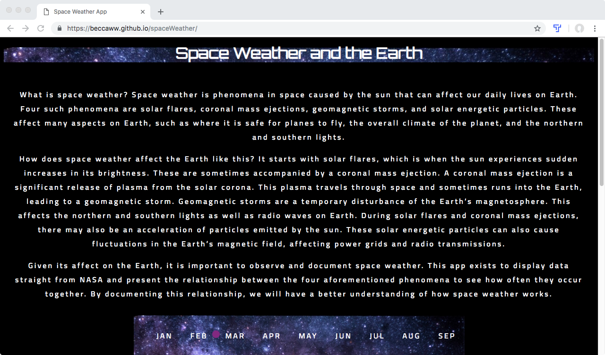
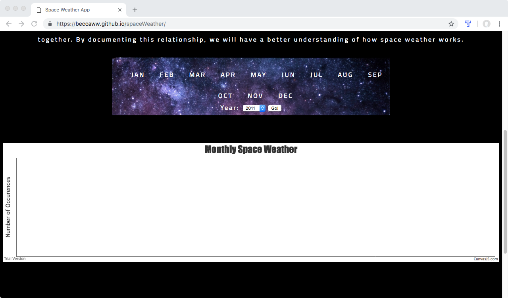
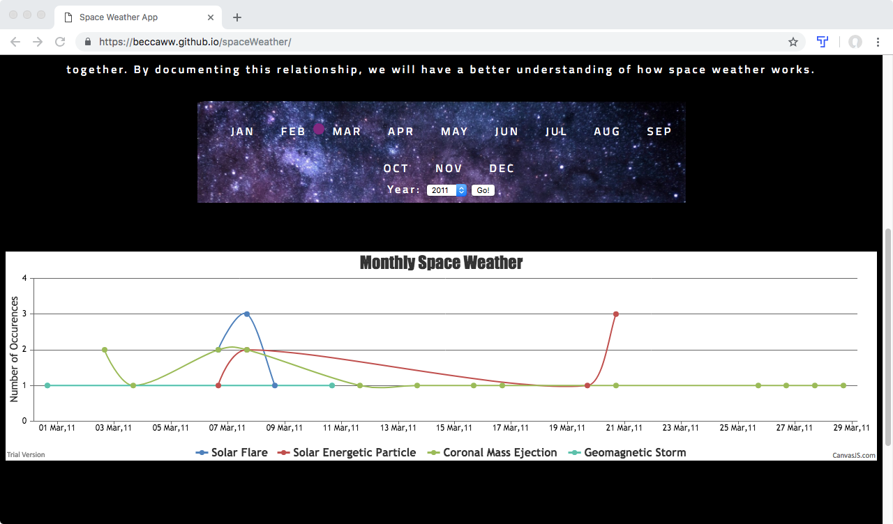
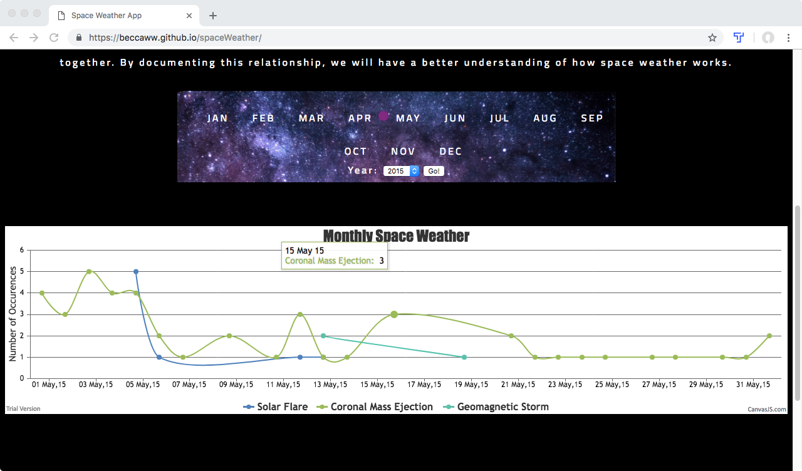

# spaceWeather
Space Weather and the Earth

https://beccaww.github.io/spaceWeather/

Summary: An app to help users see and understand the relationship between different space weather phenomena, how each one affects the other, 
by accessing the NASA API and creating a chart that clearly displays the information. The user can pick from a list of months and a
dropdown menu of available years to see the occurrences of different space weather phenomena in relation to other space weather phenomena. 

Technology used: HTML, CSS, JavaScript, jQuery

